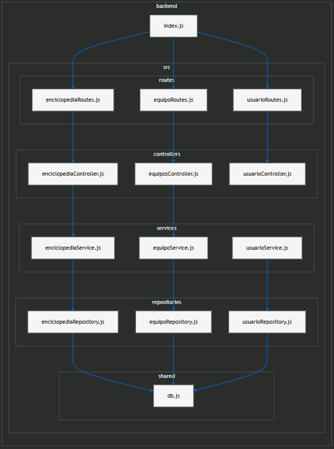
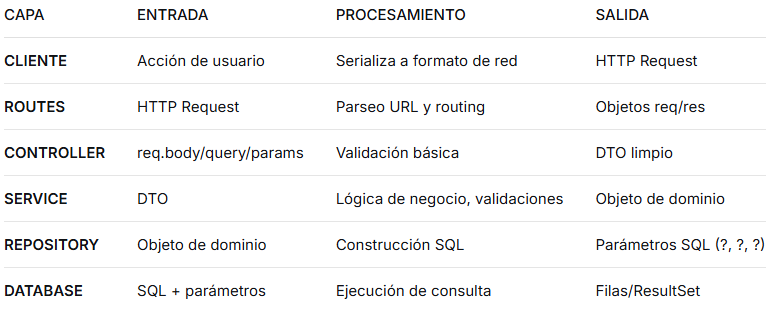

# Arquitectura del Backend - Proyecto Pokedex

Este backend está construido siguiendo un patrón de **Arquitectura en Capas (Layered Architecture)**, con una implementación robusta del **Patrón Repository**. El objetivo principal es separar las responsabilidades, facilitar el mantenimiento y garantizar la seguridad de los datos.

## Diagrama de Flujo del Sistema



---

## Explicación de las Capas

Para este proyecto, la lógica se divide en tres niveles de abstracción:


1. **Routes:** Definen los endpoints y delegan al controller. No contienen lógica de negocio ni acceso a datos.
2. **Controller (API Layer):** Gestiona las peticiones HTTP usando helpers para manejo de errores y respuestas. Recibe la solicitud y delega la ejecución a la capa de servicio.
3. **Service (Business Logic Layer):** Es el núcleo de la aplicación. Aquí se procesan las reglas de negocio (validaciones, cálculos, lógica de evolución, autenticación) antes de interactuar con los datos.
4. **Repository (Data Access Layer):** Centraliza el acceso a los datos. Implementa **Prepared Statements** para asegurar la protección contra ataques de **Inyección SQL**.

---

En la carpeta backend/data/public/
- Descargar https://drive.google.com/file/d/1zTO8OGGxQiv9WW7MsyIC9hqAEiGeyqtu/view?usp=sharing y pegar el archivo en el directorio.
- Descomprimir en carpeta "pokemon".
- ADICIONAL: el link del directorio se puede cambiar en el archivo shared/config.
- config.js tiene PORT, URL_IMAGE, BASE_URL.

* No almacenamos la url en la base de datos si no que la formamos con la URL+ID+.PNG en enciclopediaService.js

* Para añadir este dato a lo que responde enciclopediaRepository (dependiendo de si es array) usamos el **spread operator** (`...`).
  - Ejemplo en JS: `{ ...obj, nuevoCampo: valor }` crea un nuevo objeto copiando todas las propiedades de `obj` y agregando/modificando `nuevoCampo`.
  - Equivalente en Python: `{ **obj, 'nuevoCampo': valor }` (dict unpacking).
  - Equivalente en otros lenguajes: suele llamarse "object/array unpacking" o "merge".

- Más info: https://developer.mozilla.org/es/docs/Web/JavaScript/Reference/Operators/Spread_syntax


---
## FUNCIONAMIENTO

**TOP-DOWN (La Petición)**
```
[CLIENTE] 
  → HTTP POST /api/recursos 
  → Body: {"nombre": "Ejemplo", "valor": 100, "activo": true}

  
[ROUTES] 
  → Recibe: {method: 'POST', url: '/api/recursos', body: {...}}
  → Direcciona: resourceRoutes.create → ResourceController.create(req, res)

[CONTROLLER] 
  → Extrae: {params: {}, query: {}, body: {...}}
  → Llama: resourceService.crear({nombre: "Ejemplo", valor: 100, activo: true})
  → Usa helpers (handleRequest, getHttpStatus) para manejar errores y respuestas

[SERVICE] 
  → Valida: {nombre: string, valor: number, activo: boolean}
  → Transforma: {nombre: "EJEMPLO", valor: 100.00, activo: 1, fecha: "2025-01-15"}
  → Llama: resourceRepository.crear({...})

[REPOSITORY] 
  → Construye: "INSERT INTO recursos (nombre, valor, activo, fecha) VALUES (?, ?, ?, ?)"
  → Parámetros: ["EJEMPLO", 100.00, 1, "2025-01-15"]

[DATABASE] 
  → Ejecuta: INSERT
  → Retorna: {lastID: 456, changes: 1}
```

**BOTTOM-UP (La Respuesta)**

```
  
[DATABASE] 
  → Retorna: [[456, "EJEMPLO", 100.00, 1, "2025-01-15"]] (Array de arrays)
  → Estructura: [id, nombre, valor, activo, fecha]

[REPOSITORY] 
  → Mapea: {
        id: 456,
        nombre: "EJEMPLO", 
        valor: 100.00,
        activo: true,
        fecha: "2025-01-15"
    }
  → Retorna: {data: {...}, metadata: {insertId: 456}}

[SERVICE] 
  → Enriquece: {
        id: 456,
        nombre: "Ejemplo",
        valor: 100.00,
        activo: true,
        fecha: "2025-01-15T00:00:00.000Z",
        metadata: {
            impuesto: 21.00,
            total: 121.00,
            creadoHace: "hace 2 segundos"
        }
    }
  → Filtra: Elimina campos internos si es necesario

[CONTROLLER] 
  → Serializa: res.status(201).json({
        success: true,
        data: {
            id: 456,
            nombre: "Ejemplo",
            valor: 100.00,
            total: 121.00,
            fechaCreacion: "2025-01-15T00:00:00.000Z"
        },
        pagination: null
    })
  → Si ocurre un error: res.status(400).json({ success: false, error: "MENSAJE_DE_ERROR" })

[ROUTES] 
  → Envía: HTTP/1.1 201 Created
          Content-Type: application/json
          Body: {...}

[CLIENTE] 
  → Recibe: {
        "success": true,
        "data": {
            "id": 456,
            "nombre": "Ejemplo",
            "valor": 100.00,
            "total": 121.00,
            "fechaCreacion": "2025-01-15T00:00:00.000Z"
        },
        "pagination": null
    }
  → Si ocurre un error:
    {
      "success": false,
      "error": "MENSAJE_DE_ERROR"
    }
```
---

## ESTRUCTURAS DE DATOS POR CAPA

### DATOS BRUTOS ENTRE CAPAS

```
CLIENTE → ROUTES: 
  Formato: String HTTP
  Ejemplo: "POST /api/recursos HTTP/1.1\r\nContent-Type: application/json\r\n\r\n{\"nombre\":\"Ejemplo\"}"

ROUTES → CONTROLLER: 
  Formato: Objeto Express {req, res}
  req: {
    method: 'POST',
    url: '/api/recursos',
    headers: { 'content-type': 'application/json' },
    body: { nombre: 'Ejemplo', valor: 100, activo: true },
    params: {},
    query: {}
  }

CONTROLLER → SERVICE:
  Formato: Objeto JavaScript plano
  Ejemplo: { nombre: 'Ejemplo', valor: 100, activo: true }

SERVICE → REPOSITORY:
  Formato: Objeto procesado
  Ejemplo: { 
    nombre: 'EJEMPLO', 
    valor: 100.00, 
    activo: 1, 
    fecha: '2025-01-15',
    usuario_id: 123 
  }

REPOSITORY → DATABASE:
  Formato: SQL con parámetros
  Ejemplo: {
    sql: "INSERT INTO recursos (nombre, valor, activo, fecha, usuario_id) VALUES (?, ?, ?, ?, ?)",
    params: ['EJEMPLO', 100.00, 1, '2025-01-15', 123]
  }
```


### ESTRUCTURAS DE RETORNO

```
DATABASE → REPOSITORY:
  Formato: Array de arrays o objetos
  SQLite: [[456, 'EJEMPLO', 100.00, 1, '2025-01-15', 123]]
  MySQL: [{ id: 456, nombre: 'EJEMPLO', ... }]

REPOSITORY → SERVICE:
  Formato: Objeto mapeado
  Ejemplo: {
    id: 456,
    nombre: 'EJEMPLO',
    valor: 100.00,
    activo: true,
    fecha: '2025-01-15',
    usuario_id: 123
  }

SERVICE → CONTROLLER:
  Formato: Objeto enriquecido
  Ejemplo: {
    id: 456,
    nombre: 'Ejemplo',
    valor: 100.00,
    activo: true,
    fechaCreacion: '2025-01-15T00:00:00.000Z',
    metadata: {
      impuesto: 21.00,
      total: 121.00,
      creadoPor: 'usuario123'
    }
  }

CONTROLLER → ROUTES:
  Formato: Objeto respuesta HTTP
  Ejemplo éxito: {
    statusCode: 201,
    headers: { 'Content-Type': 'application/json' },
    body: '{"success":true,"data":{...}}'
  }
  Ejemplo error: {
    statusCode: 400,
    headers: { 'Content-Type': 'application/json' },
    body: '{"success":false,"error":"MENSAJE_DE_ERROR"}'
  }

ROUTES → CLIENTE:
  Formato: HTTP Response
  Ejemplo éxito: HTTP/1.1 201 Created
           Content-Type: application/json
           Content-Length: 245
           
           {"success":true,"data":{...}}
  Ejemplo error: HTTP/1.1 400 Bad Request
           Content-Type: application/json
           Content-Length: 80
           
           {"success":false,"error":"MENSAJE_DE_ERROR"}
```

---


    
---

## Fuentes y Referencias Académicas

Para el diseño de esta arquitectura se consultaron las siguientes bases técnicas (actualizadas a 2025):

### 1. Patrones de Diseño y Arquitectura
*   **[Patrón Repository (Martin Fowler)](https://martinfowler.com/eaaCatalog/repository.html):** Enlace directo al catálogo oficial de P de EAA que describe la mediación entre el dominio y el mapeo de datos.
*   **[Baeldung - Layered Architecture](www.baeldung.com):** Guía técnica sobre la separación de responsabilidades en aplicaciones modernas.

### 2. Seguridad en el Backend
*   **[Guía de Prevención de SQL Injection (OWASP)](cheatsheetseries.owasp.org):** Documento oficial de OWASP sobre defensas críticas en el backend.
*   **[Documentación de PreparedStatement (Oracle)](docs.oracle.com):** Manual oficial de Java para el manejo seguro de consultas parametrizadas.

### 3. Estándares de la Industria (2025)
*   **[Diseño de Recursos en APIs (Google)](cloud.google.com):** Estándares profesionales de Google sobre cómo estructurar la comunicación en controladores.
*   **[Microsoft - Diseño de Capa de Persistencia](https://learn.microsoft.com/en-us/dotnet/architecture/microservices/microservice-ddd-cqrs-patterns/infrastructure-persistence-layer-design):** Guía detallada sobre el desacoplamiento mediante el patrón Repository.

---

https://www.npmjs.com/package/bcrypt

